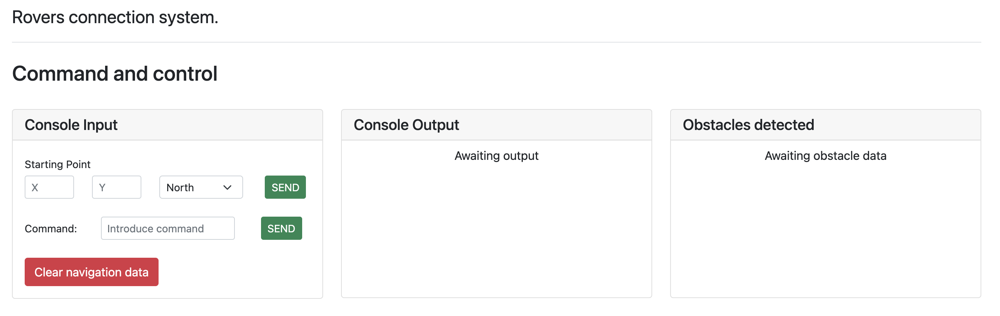

## Mars Rover



This app will allow you to move a Rovers that sits on Mars, waiting for yours command. 

The rover is sitting on a surface that is 200x200 and cannot escape it, so please don't go over the edge!.

# Installation:

There are **two** ways to install this app one is using Docker and the other one is just the normal installation

#### Docker Install
For the docker installation version of this app you will need to edit the docker-compose.yaml.dist
add modify the arguments `user` and `uid` for the ones that you are using in your current machine. 
This will ensure that you have the proper permissions to oped/edit the files.

Modify the name of the file from `docker-compose.dist.yaml` to `docker-compose.yaml`
and execute the following command: 

```
docker-compose up
```

This will build the necessary images and containers and initilice them.   

After the containers are running you need to execute two more commands

```
docker exec marsroversapp bash
```

That will get you inside the app container, then copy and paste this command:

```
composer install && cp .env.docker .env && php artisan key:generate && php artisan migrate
```

That will install all composer dependencies, create a .env file and generate a key to be used by laravel and execute 
the migrations.

To finish you will find the mars rover app in `http://localhost:8081/`

#### Normal Install
Make sure you have all the minimum requirements of [Laravel](https://laravel.com/docs/8.x/deployment#server-requirements) 8 in your machine
And that you do have a MySQL/MariaDB database version >=5.7+.

- Clone the repo.
- Run `composer install`  
- Execute `php artisan migrate`
- Load you app using the domain assigned to it, and you are ready to go.

### Steps to control the rover:

To control the rover you need to do the following:

- Give the starting point of the rover in the following syntax: `N,M` Where `N` and `M` are numbers and can 
  be any number between `0` and `199`. **IMPORTANT** The position (0,0) is locating on the bottom left of the grid.
    
- Select the direction of the where the rover is facing (NORTH/SOUTH/EAST/WEST). 
  
- Then you are free to send the command to the Rover using the following syntax: 
```
FFRRFFFRL
```

**Commands can be composed of up to 9 instructions.**

Where: 
- `F` means Forward.
- `R` means Right.
- `L` means Left.

When the rover takes a left or a right turn **it does not** turn on it's on axis changing direction. 
Rather the vehicle move using side step, which allows it to keep the same direction. 

If you want to start again, you can use the "Clear navigation data".

#### Obstacles:

The obstacles are generated in real time, this creates an ever-changing surface.

If the rovers finds an obstacle, the command will be halted and the rover will return to the previous
safe spot.

---
### Internals. 

The app work with the following api endpoints:


| METHOD |         Endpoint        |                                        Description                                       |
|:------:|:-----------------------:|:----------------------------------------------------------------------------------------:|
|   GET  | api/initial-coordinates |               Returns the initial coordinates, if there are not returs null              |
|   GET  |  api/previous-movements | Returns the previous movements and obstacles, and empty string will be returned if empty |
|  POST  |   api/set-coordinates   |                                Set the initial coordinates                               |
|  POST  |     api/send-command    |                               Send The command to the Rover                              |
|  POST  |   api/clear-navigation  |                       Clears the navigation data from the Database                       |


Test can be found in `tests/features` and can be executed using `php artisan test`. 

One caveat regarding tests is that they use the `RefreshDatabase` trait, so update your `.env.test` as you see fit.

---

### Considerations and Improvements.

- The movements and obstacles list are only displaying the last 10 items, to improve this: 
    - The movements and obstacles list can be paginated and request a new page 
      when the user scroll to the bottom of "card".
- Instead of generating the obstacles in real time, could be an option to generate the entire 200x200 grid.
- Various Improvement to the interface:
    - mobile ready.
    - improve spacing between elements.
